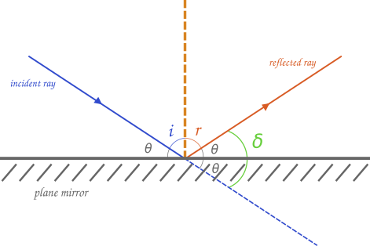

# Reflection

### *Reflection in plane mirror*

* The angle by which the incident ray deviates  ($\delta$)  after reflecting from a plane mirror is given by

  $\delta = 2\theta\\ \ \ = 180^\circ - (i + r)\\ \ \ =180^\circ - 2i$

* If the incident ray is rotated through an angle of $\theta$ then the reflected ray is also rotated through an angle of $\theta$.

  

* If the mirror is rotated by an angle of $\theta$ then the reflected ray is rotated through an angle of $2\theta$.

  

* If the mirror and the incident ray both are rotated through an angle of $\theta$ then the reflected ray is rotated by

  $\Delta r = 2\theta + \theta\\ \ \ \ \ \ = 3\theta$ 

  

* Image formed by plane mirror is virtual, erect and laterally inverted.

  

* Object distance $(u)​$ is always equal to the image distance $(v)​$

  $u = v$

  Hence, object velocity $(\vartheta_o)$ is also equal to image velocity $(\vartheta_i)$

  $  \ \ \ \ \ \ u = v\\or,\frac{u}{t} = -\frac{v}{t}\\or, \vartheta_o = -\vartheta_i $

  Here, the negative sign denotes that the direction of the two velocities are opposite. 

  Also, the velocity of the image relative to the velocity of the object (relative velocity) is given by

  $\vartheta_{io}= \vartheta_o - \vartheta_i\\ \ \ \ \ \ = \vartheta_o - (-\vartheta_o)\\ \ \ \ \ \ = 2\vartheta_o$